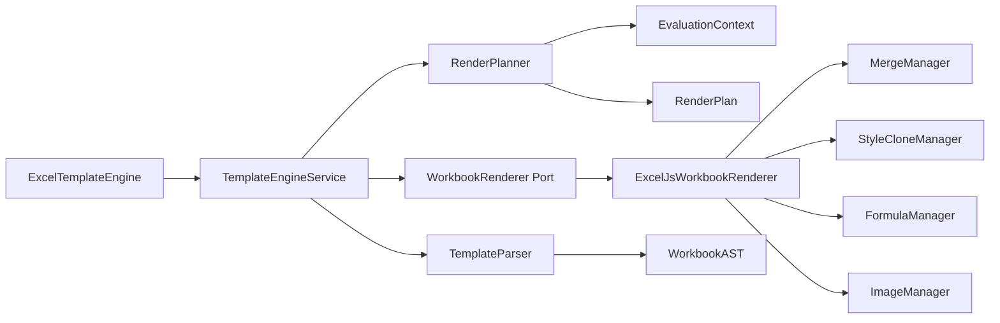

# Tài Liệu Kiến Trúc

## Mục Tiêu

`excel-template-engine` sinh workbook Excel từ template `.xlsx` thật và dữ liệu JSON. Engine phải giữ được style, merge cell, formula, image và cấu trúc multi sheet của file gốc, đồng thời có kiến trúc đủ sạch để mở rộng trong nhiều năm.

Thư viện có thể học ý tưởng từ `xlsx-template`, nhưng không phụ thuộc hoàn toàn, không wrap lại API của thư viện đó và không copy mô hình xử lý XML nguyên khối.

## Phân Tích Tham Khảo: xlsx-template

File `xlsx-template-lib.js` hiện tại dùng một class `Workbook` rất lớn để:

- Mở file `.xlsx` như một ZIP và đọc trực tiếp XML workbook, worksheet, shared strings, relationships, tables, drawings và content types.
- Tìm placeholder trong shared string.
- Thay giá trị trực tiếp khi đang duyệt từng row/cell.
- Clone dòng/cột khi gặp array hoặc table placeholder.
- Dịch chuyển merge cell, named range, hyperlink, table range.
- Chèn image bằng drawing/media relationship.
- Xóa calc chain để Excel tự tính lại formula.

### Nên Tái Sử Dụng Ý Tưởng

- Utility xử lý địa chỉ Excel: parse `A1`, parse range, đổi số cột thành chữ cột và ngược lại.
- Mọi thay đổi layout phải cập nhật đồng bộ cell, merge, hyperlink, named range, table, image và formula.
- Khi clone dòng/cột/block phải clone style và kích thước.
- Formula cache nên được xóa hoặc đánh dấu recalc sau khi layout thay đổi.
- Image cần một manager riêng vì liên quan tới file asset, kích thước cell/merge và workbook relationship.

### Nên Viết Lại Hoàn Toàn

- Placeholder không nên xử lý bằng một regex duy nhất trên từng cell. Cần lexer, parser và AST riêng.
- Render không nên vừa đọc template vừa mutate workbook trong cùng một vòng lặp. Cần tách `RenderPlan` khỏi renderer.
- ExcelJS chỉ nằm ở tầng infrastructure; core không phụ thuộc ExcelJS.
- Helper, data scope và nested loop phải độc lập với thao tác workbook.
- Merge/formula/style/image phải có manager riêng để test và thay thế được.

## Các Tầng Kiến Trúc

```text
src/core
  Lexer, parser, AST, resolve dữ liệu, helper registry.

src/application
  Điều phối engine, tạo RenderPlan, định nghĩa port cho renderer và manager.

src/infrastructure
  Adapter ExcelJS, asset resolver, manager cụ thể cho ExcelJS.

src/shared
  Address utility, error, result type và type dùng chung.
```

## Pipeline Render

```text
ExcelTemplateEngine.render()
  -> WorkbookRenderer.load()
  -> TemplateParser.parseWorkbook()
  -> RenderPlanner.createPlan()
  -> WorkbookRenderer.apply()
  -> WorkbookRenderer.write()
```

## AST

```text
WorkbookAST
└── SheetAST
    └── RowAST
        └── CellAST
            └── TemplateNode[]
```

Các node chính:

- `TextNode`: text thường trong cell.
- `PlaceholderNode`: path dữ liệu như `teacher.name`.
- `EachNode`: loop theo dòng.
- `EachColumnNode`: loop theo cột.
- `BlockNode`: clone một vùng nhiều dòng/cột.
- `IfNode`: điều kiện hiển thị.
- `HelperNode`: gọi helper như `sum(scores)`.
- `ImageNode`: chèn image từ dữ liệu.

## Nguyên Tắc Render

- Parser chỉ hiểu cú pháp template.
- Planner biến AST và JSON thành danh sách operation.
- Renderer thực thi operation lên workbook.
- Manager xử lý nghiệp vụ Excel phức tạp:
  - `MergeManager`: clone/shift merge range.
  - `FormulaManager`: shift formula và clear cache.
  - `StyleCloneManager`: clone font, fill, border, alignment, numFmt, width, height.
  - `ImageManager`: resolve và chèn image.

## Sơ Đồ Phụ Thuộc



## Điểm Mở Rộng

- Thêm cú pháp mới bằng token và AST node mới.
- Thêm helper qua `engine.registerHelper(name, fn)`.
- Thêm renderer mới bằng cách implement `WorkbookRenderer`.
- Thêm nguồn image mới bằng `AssetResolver`.
- Thay đổi chính sách formula bằng `FormulaManager`.
