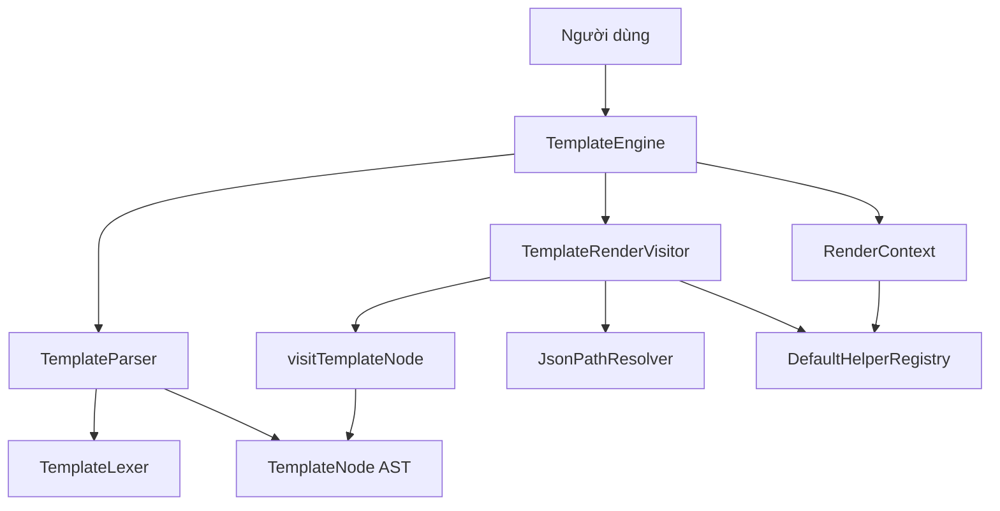
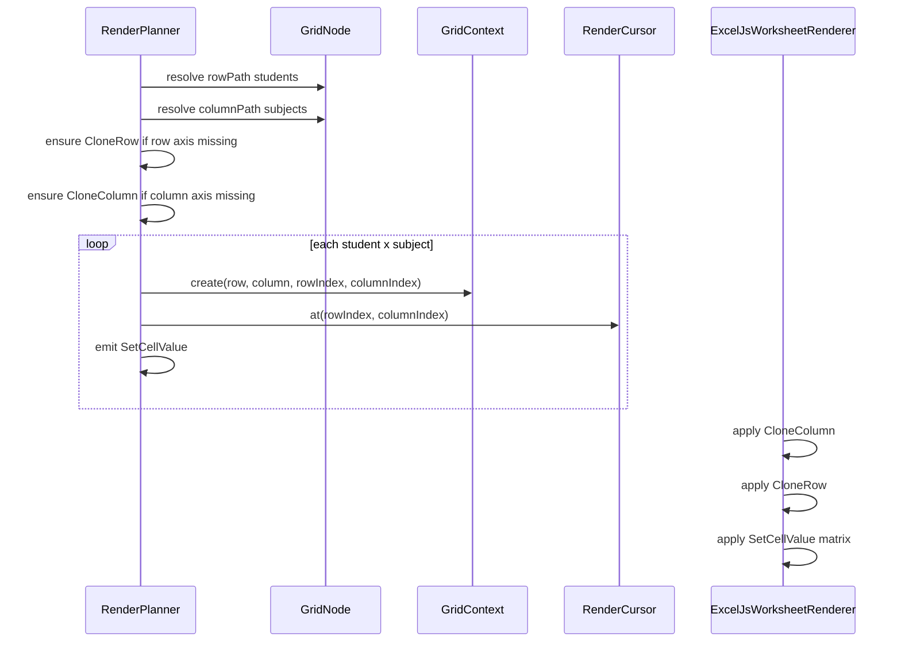

# Core Engine

Tài liệu này mô tả phần core vừa được implement. Phần này không phụ thuộc ExcelJS và không ghi file `.xlsx`; nhiệm vụ của nó là parse template syntax, tạo AST, duyệt AST bằng Visitor Pattern và render chuỗi kết quả từ JSON data.

## Thành Phần Chính

- `TemplateLexer`: tách template string thành token.
- `TemplateParser`: parse template thành AST node.
- `TemplateNode`: tập node chuẩn của engine.
- `TemplateNodeVisitor`: interface visitor cho toàn bộ node.
- `visitTemplateNode`: dispatcher của Visitor Pattern.
- `RenderContext`: giữ root data, current scope, helper registry và chính sách missing value.
- `TemplateRenderVisitor`: visitor mặc định để render AST thành string.
- `TemplateEngine`: facade core cho `parse()` và `render()`.

## Node Đang Hỗ Trợ

- `TextNode`
- `PlaceholderNode`
- `EachNode`
- `EachColumnNode`
- `IfNode`
- `HelperNode`
- `ImageNode`
- `BlockNode`

Trong core layer, `EachColumnNode` và `BlockNode` render theo semantics lặp dữ liệu giống `EachNode`. Khi tích hợp Excel renderer sau này, hai node này sẽ được planner/renderer diễn giải thành thao tác clone cột hoặc clone block.

`ImageNode` trong core layer trả về giá trị path/source đã resolve. Việc chèn image thật vào workbook thuộc trách nhiệm của renderer tầng infrastructure.

`EachColumnNode` trong ExcelJS renderer đã hỗ trợ dynamic column expansion ở mức cơ bản: planner sinh `CloneColumn` và `SetCellValue`, renderer chèn thêm cột, clone width, clone style cell/column và clone merge range theo cột mẫu.

`GridNode` là node tạo ma trận dữ liệu từ hai collection, ví dụ `students` và `subjects`. Planner dùng `GridContext` để tạo scope cho từng ô giao nhau và `RenderCursor` để tính địa chỉ cell từ ô gốc.

## Dependency Graph



## Luồng Hoạt Động

1. Người dùng gọi `TemplateEngine.render(template, data)`.
2. `TemplateEngine` gọi `TemplateParser.parseCell(template)`.
3. Parser đọc cú pháp `{{...}}`, tạo danh sách `TemplateNode`.
4. `TemplateEngine` tạo `RenderContext` từ root JSON data.
5. `TemplateRenderVisitor` duyệt từng node bằng `visitTemplateNode`.
6. Với `PlaceholderNode`, visitor dùng `JsonPathResolver` để đọc dữ liệu.
7. Với `HelperNode`, visitor resolve argument rồi gọi `DefaultHelperRegistry`.
8. Với `IfNode`, visitor render children khi condition truthy.
9. Với `EachNode`, `EachColumnNode`, `BlockNode`, visitor tạo child context cho từng item rồi render children.
10. Kết quả cuối cùng được nối thành string.

## Ví Dụ

```ts
import { TemplateEngine } from 'excel-template-engine';

const engine = new TemplateEngine();

engine.registerHelper('sum', ([values]) => {
  if (!Array.isArray(values)) {
    return 0;
  }

  return values.reduce((total, value) => total + Number(value), 0);
});

const output = await engine.render(
  'GV: {{teacher.name}} - Tổng: {{sum(scores)}}',
  {
    teacher: { name: 'Nguyễn Văn A' },
    scores: [8, 9, 10],
  },
);
```

Kết quả:

```text
GV: Nguyễn Văn A - Tổng: 27
```

## Placeholder Renderer

Placeholder hiện dùng `ExpressionEvaluator` riêng, không dùng `eval` và không dùng `Function constructor`.

Các expression đang hỗ trợ:

```text
{{teacher.name}}
{{contract.code}}
{{user.profile.email}}
{{teacher.name ?? "Unknown"}}
```

Đặc điểm:

- Hỗ trợ nested object bằng dot path.
- Hỗ trợ array index như `students[0].name`.
- Null safe: nếu gặp `null` hoặc `undefined` giữa path, evaluator trả về missing value thay vì throw mặc định.
- Hỗ trợ default value bằng toán tử `??`.
- `??` chỉ dùng fallback khi giá trị bên trái là `null` hoặc `undefined`; các giá trị `''`, `false`, `0` vẫn được giữ nguyên.

Benchmark đơn giản:

```bash
npm run benchmark:placeholder
```

## EachNode Renderer

`EachNode` dùng `LoopContext` riêng để cung cấp metadata cho từng item:

- `{{index}}`: vị trí item, bắt đầu từ `0`.
- `{{first}}`: `true` nếu là item đầu tiên.
- `{{last}}`: `true` nếu là item cuối cùng.
- `{{length}}`: tổng số item trong loop.
- `{{parent.index}}`: truy cập index của loop cha khi nested loop.

Ví dụ:

```text
{{#each students}}
{{index}} - {{name}} - {{first}} - {{last}}
{{/each}}
```

Nested loop được hỗ trợ bằng cách mỗi vòng lặp tạo `RenderContext.child(item, loopContext)` riêng. Loop bên trong có `index/first/last` riêng và vẫn giữ tham chiếu tới loop cha.

### Sequence Diagram

```mermaid
sequenceDiagram
  participant Engine as TemplateEngine
  participant Parser as TemplateParser
  participant Visitor as TemplateRenderVisitor
  participant Context as RenderContext
  participant Loop as LoopContext
  participant Resolver as ExpressionEvaluator

  Engine->>Parser: parseCell(template)
  Parser-->>Engine: EachNode(children)
  Engine->>Visitor: render(nodes, rootContext)
  Visitor->>Resolver: evaluate(each.path, rootContext)
  Resolver-->>Visitor: array items
  loop For each item
    Visitor->>Loop: forItem(index, length, parentLoop)
    Visitor->>Context: child(item, loopContext)
    Visitor->>Visitor: render children with child context
    Visitor->>Resolver: evaluate(name/index/first/last)
    Resolver-->>Visitor: item value or loop metadata
  end
  Visitor-->>Engine: rendered string
```

## GridNode Renderer

Cú pháp:

```text
{{#grid students subjects}}
{{score}}
{{/grid}}
```

Với workbook template:

```text
A1: Sinh viên
B1: {{#each-col subjects}}{{name}}{{/each-col}}
A2: {{#each students}}{{name}}{{/each}}
B2: {{#grid students subjects}}{{score}}{{/grid}}
```

Luồng render:

1. `EachColumnNode` ở `B1` sinh các cột subject.
2. `EachNode` ở `A2` sinh các dòng student.
3. `GridNode` ở `B2` fill từng ô giao nhau.
4. `GridContext` cung cấp `row`, `column`, `subject`, `rowIndex`, `columnIndex`, `score`.
5. `RenderCursor` tính địa chỉ từ `B2` sang `B2:D3`.

### Sequence Diagram



## Giới Hạn Cố Ý Của Bước Này

- Chưa implement ExcelJS renderer.
- Chưa clone row/column/block trong workbook thật.
- Chưa xử lý formula update.
- Chưa xử lý image thật trong `.xlsx`.
- Chưa xử lý block clone đầy đủ trong workbook thật.
- Chưa chèn image thật vào `.xlsx`.

Các phần đó thuộc bước renderer/planner sau, xây trên AST và visitor đã có.
