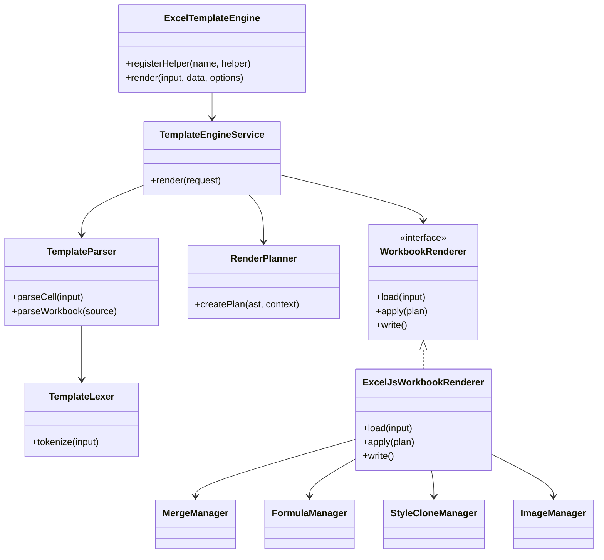
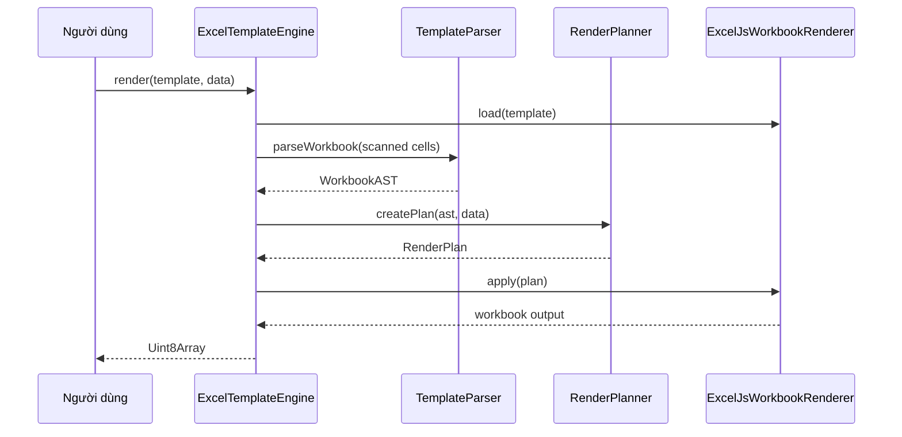
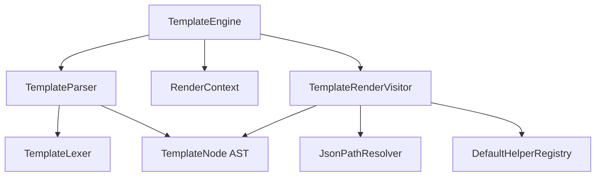
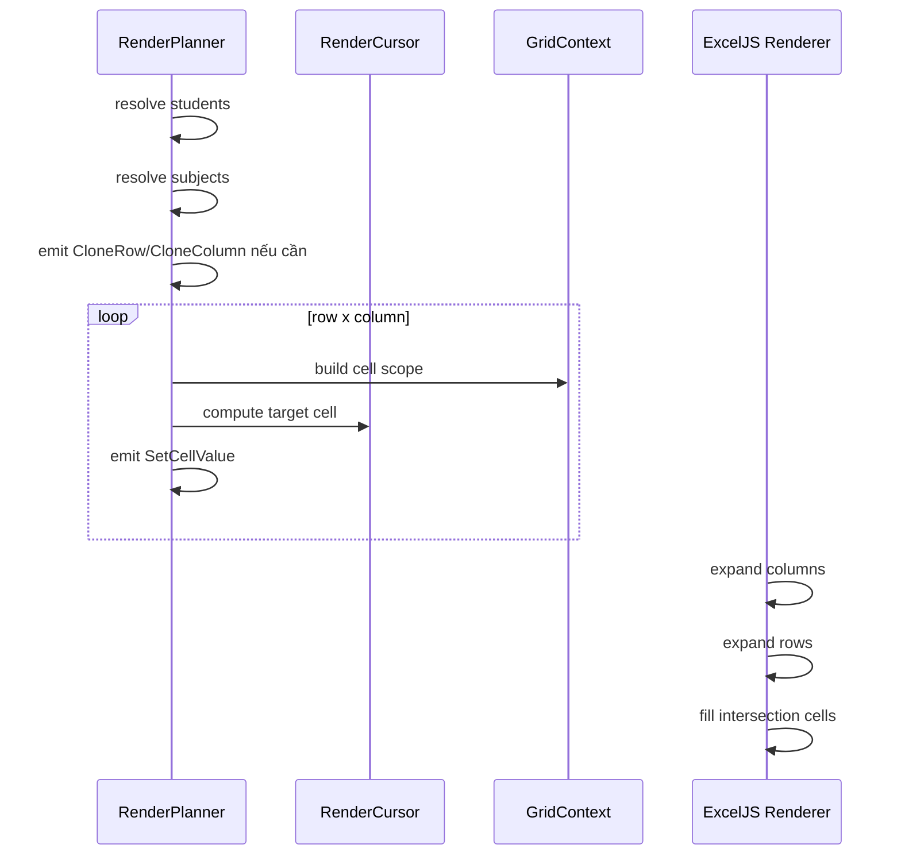

# UML Và Sơ Đồ Phụ Thuộc

## Sơ Đồ Thành Phần



## Luồng Render



## Sơ Đồ Core Engine



## Sequence EachNode Renderer

```mermaid
sequenceDiagram
  participant Visitor as TemplateRenderVisitor
  participant Evaluator as ExpressionEvaluator
  participant Loop as LoopContext
  participant Child as RenderContext child

  Visitor->>Evaluator: evaluate(each.path)
  Evaluator-->>Visitor: array
  loop item trong array
    Visitor->>Loop: forItem(index, length, parent)
    Visitor->>Child: create child context
    Visitor->>Evaluator: evaluate child placeholders
    Evaluator-->>Visitor: value/index/first/last
  end
```

## Sequence GridNode Renderer


